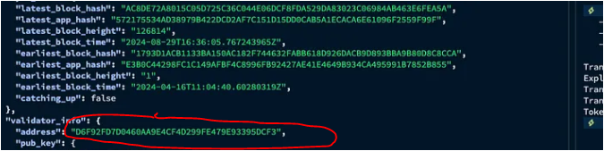

# Introduction to Story: Revolutionizing Intellectual Property
Story is transforming the way we perceive and manage intellectual property (IP). Traditionally, IP was largely about legal protections for writers and artists, but today, creativity extends far beyond those boundaries — even encompassing AI-generated works. In this evolving landscape, the traditional, cumbersome processes for registering and protecting IP no longer suffice. Story addresses this by placing everything on-chain, and introducing programmable IP that simplifies the management and protection of creative works.
Setting up a validator for the Story network is essential for securing and decentralizing the platform. Story revolutionizes intellectual property (IP) by making it programmable and easily managed on the blockchain. As a validator, you help maintain the network’s integrity, enabling creators to license, remix, and monetize their work transparently and securely. This guide will help you quickly set up your own Story validator node.

To run a validator node, you need to set up a VPS with at least the following specifications. However, if you have a system at home with these specs and a stable internet connection, you can connect your node as well. It’s recommended to install Ubuntu 22.04 LTS as the operating system.

[Download Ubuntu Server](https://ubuntu.com/download/server)

## Recommended System:
CPU: **4 Cores**
RAM: **8GB**
Disk: **200GB**
Bandwidth: **10 MBit/s**

# To set up the node, execute the following commands in order:

### 1- Update your operating system and install the necessary software:
``
sudo apt update
sudo apt-get update
sudo apt install curl git make jq build-essential gcc unzip wget lz4 aria2 -y
``

### 2- Install the Go language if it’s not already installed:
``
cd $HOME && \
ver=”1.22.0" && \
wget “https://golang.org/dl/go$ver.linux-amd64.tar.gz" && \
sudo rm -rf /usr/local/go && \
sudo tar -C /usr/local -xzf “go$ver.linux-amd64.tar.gz” && \
rm “go$ver.linux-amd64.tar.gz” && \
echo “export PATH=$PATH:/usr/local/go/bin:$HOME/go/bin” >> ~/.bash_profile && \
source ~/.bash_profile && \
go version
``

### 3- Install the execution layer, which is Geth:
``
wget https://story-geth-binaries.s3.us-west-1.amazonaws.com/geth-public/geth-linux-amd64-0.9.2-ea9f0d2.tar.gz
tar -xzvf geth-linux-amd64–0.9.2-ea9f0d2.tar.gz
[ ! -d “$HOME/.story/geth” ] && mkdir -p $HOME/.story/geth
if ! grep -q “$HOME/.story/geth” $HOME/.bash_profile; then
 echo ‘export PATH=$PATH:$HOME/.story/geth’ >> $HOME/.bash_profile
fi
sudo cp geth-linux-amd64–0.9.2-ea9f0d2/geth $HOME/.story/geth/
source $HOME/.bash_profile
geth version
``

### 4- Install the Story software:
``
wget https://story-geth-binaries.s3.us-west-1.amazonaws.com/story-public/story-linux-amd64-0.9.11-2a25df1.tar.gz
tar -xzvf story-linux-amd64–0.9.11–2a25df1.tar.gz
[ ! -d “$HOME/.story/story” ] && mkdir -p $HOME/.story/story
if ! grep -q “$HOME/.story/story” $HOME/.bash_profile; then
 echo ‘export PATH=$PATH:$HOME/.story/story’ >> $HOME/.bash_profile
fi
sudo cp story-linux-amd64–0.9.11–2a25df1/story $HOME/.story/story/
source $HOME/.bash_profile
story version
``

### 5- Initialize Story with the following command:
`story init — network iliad`
Optionally, you can name your node with the following command:
`story init — network iliad — moniker “Your_moniker_name”`

### 6- Add the running peers with the following command:
``
PEERS="a320f8a15892bddd7b5502527e0d11c5b5b9d0e3@69.67.150.107:29931,2f372238bf86835e8ad68c0db12351833c40e8ad@story-testnet-rpc.itrocket.net:26656,d4c5dcfbec11d80399bcf18d83a157259ca3efc7@138.201.200.100:26656,15c7e2b630c04ee11b2c3cfbfb1ede0379df9407@52.74.117.64:26656,359e4420e63db005d8e39c490ad1c1c329a68df3@3.222.216.118:26656,eeb7d2096a887f8ff8fdde2695c394fcf5a19273@194.238.30.192:36656,0b512c9a4421c0259813aaa05c865f82365fa7c0@3.1.137.11:26656,f4d96bf0dc67a05a48287ca2c821bc8e1d2b2023@63.35.134.129:26656,5e4f9ce2d20f2d3ef7f5c92796b1b954384cbfe1@34.234.176.168:26656,371ee318d105b0239b3997c287068ccbbcd46a91@3.248.113.42:26656,df40eee673df8eb3eddd10b359539f0e86ecaee3@207.244.230.111:36656,c82d2b5fe79e3159768a77f25eee4f22e3841f56@3.209.222.59:26656,960278d079a111b44c207dca7c2ffac640b477d1@44.223.234.211:26656,1708afbf73e2fbbb5a943aa2d97c976bf8e0d25c@52.9.183.131:26656,1cceccb08bae25a0f91fe85b0ca562fa791f47aa@184.169.154.204:26656,8876a2351818d73c73d97dcf53333e6b7a58c114@3.225.157.207:26656,0a2bc2ce69b7292deaf0b6a33af76bf9b2e25ec6@88.198.46.55:41656,6bb4ed28b08a186fc1373cfc2e96b83165c1e882@162.55.245.254:33656,a2fe3dfd6396212e8b4210708e878de99307843c@54.209.160.71:26656,aac5871efa351872789eef15c2da7a55a68abdad@88.218.226.79:26656"
sed -i -e "/^\[p2p\]/,/^\[/{s/^[[:space:]]*persistent_peers *=.*/persistent_peers = \"$PEERS\"/}" $HOME/.story/story/config/config.toml
``

### 7- Create the story-geth service with the following command:
``
sudo tee /etc/systemd/system/story-geth.service > /dev/null <<EOF
[Unit]
Description=Story Geth Client
After=network.target
[Service]
User=root
ExecStart=/root/.story/geth/geth - iliad - syncmode full
Restart=on-failure
RestartSec=3
LimitNOFILE=4096
[Install]
WantedBy=multi-user.target
EOF
``

### 8- Create the story service with the following command:
``
sudo tee /etc/systemd/system/story.service > /dev/null <<EOF
[Unit]
Description=Story Consensus Client
After=network.target
[Service]
User=root
ExecStart=/root/.story/story/story run
Restart=on-failure
RestartSec=3
LimitNOFILE=4096
[Install]
WantedBy=multi-user.target
EOF
``

### 9- Start the story-geth service with the following commands:
``
sudo systemctl daemon-reload && \
sudo systemctl enable story-geth && \
sudo systemctl start story-geth
``

### 10- Start the story service with the following commands:
``
sudo systemctl daemon-reload && \
sudo systemctl enable story && \
sudo systemctl start story
``

### 11- View the logs of the above services with the following commands:
``
sudo journalctl -u story-geth -f -o cat
sudo journalctl -u story -f -o cat
``

# Creating a Validator:

With step 5, you have already configured Story, so you don’t need to create a new validator. However, you can access the private keys and node address with the following commands:

#### To view the validator key:
`story validator export`

#### To view the validator’s private key:
`story validator export - export-evm-key`

If the key is not displayed, it might show the private key path instead, like this:

    EVM Private Key saved to: /root/.story/story/config/private_key.txt

#### You can view it with:
`cat /root/.story/story/config/private_key.txt; echo`

## Finally, note that your node will require IP tokens for staking. Transfer the tokens to your node address and stake them with the following commands:

#### 1- Create the staking amount:
`story validator create - stake 1000000000000000000 - private-key "your_private_key"`

#### 2- Stake the tokens:
`story validator stake \`
` - validator-pubkey "VALIDATOR_PUB_KEY_IN_BASE64" \`
` - stake 1000000000000000000 \`
` - private-key xxxxxxxxxxxxxx`

> The stake amount should be entered in wei, where 1 IP token equals 1000000000000000000 wei.

##### To check if your node is running correctly, use the following command to ensure the number of blocks is greater than 0:
`curl -s localhost:26657/status | jq .result.sync_info.latest_block_height`

#### To get your validator name, use the following command:
`curl localhost:26657/status | jq`

You can copy the hex-code from the resulting JSON and paste it on [this website](https://testnet.story.explorers.guru/) to view your validator’s name.

## Conclusion
By setting up a Story validator, you’ve contributed to the security and decentralization of a pioneering platform. Your role ensures the reliability of Story’s network, empowering creators to manage and monetize their intellectual property transparently and securely.
